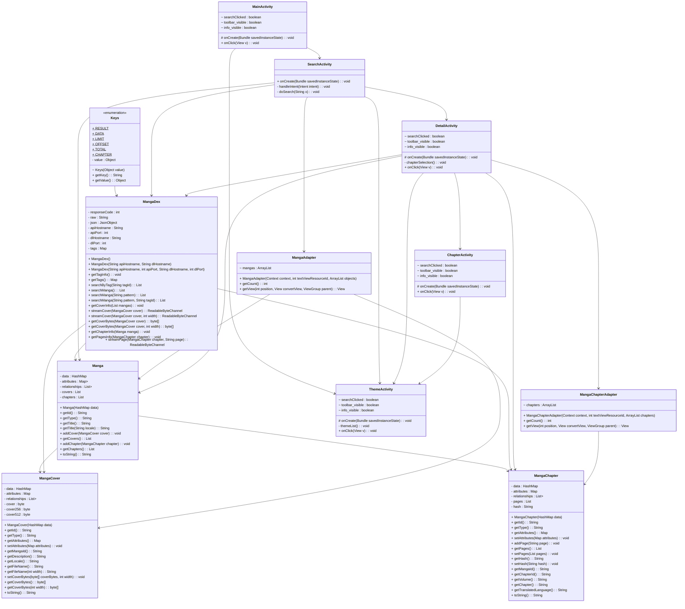

# Android Manga Reader

This is a manga reader for android using MangaDex API

## Architecture

```mermaid
classDiagram
  class MangaChapterAdapter {

    ~ chapters : ArrayList<MangaChapter>
    + MangaChapterAdapter(Context context, int textViewResourceId, ArrayList<MangaChapter> chapters)
    + getCount() : int
    + getView(int position, View convertView, ViewGroup parent) : View
  }
  class MangaCover {

    - data : HashMap<String, Object>
    - attributes : Map<String, String>
    - relationships : List<Map<String, String>>
    - cover : byte
    - cover256 : byte
    - cover512 : byte
    + MangaCover(HashMap<String, Object> data)
    + getId() : String
    + getType() : String
    + getAttributes() : Map<String, String>
    + setAttributes(Map<String, String> attributes) : void
    + getMangaId() : String
    + getDescription() : String
    + getLocale() : String
    + getFileName() : String
    + getFileName(int width) : String
    + setCoverBytes(byte[] coverBytes, int width) : void
    + getCoverBytes() : byte[]
    + getCoverBytes(int width) : byte[]
    + toString() : String
  }
  class MangaDex {

    - responseCode : int
    - raw : String
    - json : JsonObject
    - apiHostname : String
    - apiPort : int
    - dlHostname : String
    - dlPort : int
    - tags : Map<String, String>
    + MangaDex()
    + MangaDex(String apiHostname, String dlHostname)
    + MangaDex(String apiHostname, int apiPort, String dlHostname, int dlPort)
    + getTagInfo() : void
    + getTags() : Map<String, String>
    + searchByTag(String tagId) : List<Manga>
    + searchManga() : List<Manga>
    + searchManga(String pattern) : List<Manga>
    + searchManga(String pattern, String tagId) : List<Manga>
    + getCoverInfo(List<Manga> mangas) : void
    + streamCover(MangaCover cover) : ReadableByteChannel
    + streamCover(MangaCover cover, int width) : ReadableByteChannel
    + getCoverBytes(MangaCover cover) : byte[]
    + getCoverBytes(MangaCover cover, int width) : byte[]
    + getChapterInfo(Manga manga) : void
    + getPagesInfo(MangaChapter chapter) : void
    + streamPage(MangaChapter chapter, String page) : ReadableByteChannel
  }
  class Keys {
<<enumeration>>
    + RESULT$  
    + DATA$  
    + LIMIT$  
    + OFFSET$  
    + TOTAL$  
    + CHAPTER$  
    - value : Object
    ~ Keys(Object value)
    + getKey() : String
    + getValue() : Object
  }
  class DetailActivity {

    ~ searchClicked : boolean
    ~ toolbar_visible : boolean
    ~ info_visible : boolean
    # onCreate(Bundle savedInstanceState) : void
    - chapterSelection() : void
    + onClick(View v) : void
  }
  class Manga {

    - data : HashMap<String, Object>
    - attributes : Map<String, Map<String, Object>>
    - relationships : List<Map<String, String>>
    - covers : List<MangaCover>
    - chapters : List<MangaChapter>
    + Manga(HashMap<String, Object> data)
    + getId() : String
    + getType() : String
    + getTitle() : String
    + getTitle(String locale) : String
    + addCover(MangaCover cover) : void
    + getCovers() : List<MangaCover>
    + addChapter(MangaChapter chapter) : void
    + getChapters() : List<MangaChapter>
    + toString() : String
  }
  class MainActivity {

    ~ searchClicked : boolean
    ~ toolbar_visible : boolean
    ~ info_visible : boolean
    # onCreate(Bundle savedInstanceState) : void
    + onClick(View v) : void
  }
  class MangaChapter {

    - data : HashMap<String, Object>
    - attributes : Map<String, String>
    - relationships : List<Map<String, String>>
    - pages : List<String>
    - hash : String
    + MangaChapter(HashMap<String, Object> data)
    + getId() : String
    + getType() : String
    + getAttributes() : Map<String, String>
    + setAttributes(Map<String, String> attributes) : void
    + addPage(String page) : void
    + getPages() : List<String>
    + setPages(List<String> pages) : void
    + getHash() : String
    + setHash(String hash) : void
    + getMangaId() : String
    + getChapterId() : String
    + getVolume() : String
    + getChapter() : String
    + getTranslatedLanguage() : String
    + toString() : String
  }
  class ThemeActivity {

    ~ searchClicked : boolean
    ~ toolbar_visible : boolean
    ~ info_visible : boolean
    # onCreate(Bundle savedInstanceState) : void
    - themeList() : void
    + onClick(View v) : void
  }
  class ChapterActivity {

    ~ searchClicked : boolean
    ~ toolbar_visible : boolean
    ~ info_visible : boolean
    # onCreate(Bundle savedInstanceState) : void
    + onClick(View v) : void
  }
  class MangaAdapter {

    ~ mangas : ArrayList<Manga>
    + MangaAdapter(Context context, int textViewResourceId, ArrayList<Manga> objects)
    + getCount() : int
    + getView(int position, View convertView, ViewGroup parent) : View
  }
  class SearchActivity {

    + onCreate(Bundle savedInstanceState) : void
    - handleIntent(Intent intent) : void
    - doSearch(String x) : void
  }

Keys --> MangaDex

Manga --> MangaCover
Manga --> MangaChapter

MangaDex --> Manga
MangaDex --> MangaCover
MangaDex --> MangaChapter

MainActivity --> SearchActivity
MainActivity --> ThemeActivity

SearchActivity --> MangaAdapter
SearchActivity --> DetailActivity
SearchActivity --> ThemeActivity
SearchActivity --> MangaDex
SearchActivity --> Manga

MangaAdapter --> Manga
MangaAdapter --> MangaCover

DetailActivity --> MangaChapterAdapter
DetailActivity --> ChapterActivity
DetailActivity --> ThemeActivity
DetailActivity --> MangaDex
DetailActivity --> Manga
DetailActivity --> MangaChapter

MangaChapterAdapter --> MangaChapter

ChapterActivity --> ThemeActivity
```
